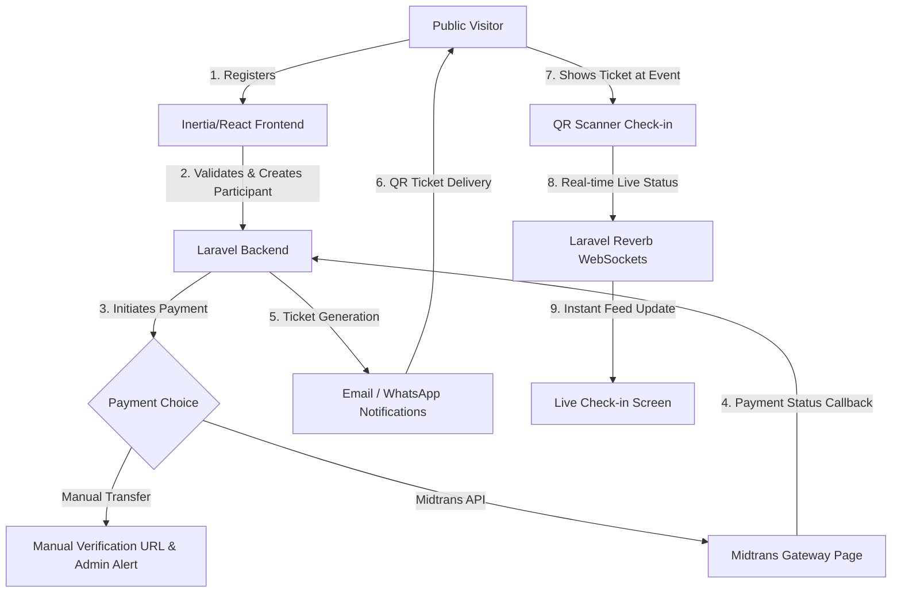

<p align="center">
  
</p>

<h1 align="center">🌀 ZAWAWALK APPS 🌀</h1>
<p align="center">
  <strong>Advanced Event Management System with Dynamic Forms, Modular Plugins, and Real-time Live Check-in</strong>
</p>

<p align="center">
  <a href="https://github.com/3flonet/zawawalk/actions"></a>
  <a href="https://packagist.org/packages/laravel/framework"></a>
  <a href="https://react.dev/"></a>
  <a href="https://tailwindcss.com/"></a>
  <a href="https://github.com/3flonet/zawawalk/blob/main/LICENSE"></a>
</p>

---

## ⚡ Overview
**Zawawalk Apps** is a state-of-the-art, high-performance event management system engineered specifically for hosting major public events like Fun Walks, Festivals, and Marathons. Built with **Laravel 13**, **Inertia.js (React + TypeScript)**, and **Tailwind CSS**, the platform offers a premium, high-tech interface coupled with robust back-end features including dynamic form builders, modular plugin architectures, multi-method payment processors, and real-time QR-based live check-ins.

---

## 🚀 Key Features

*   🛠️ **Dynamic Registration Form Builder:** Create and customize schema-based forms with fields like dynamic signature pads, file uploads, rating options, date-pickers, and conditional logic directly from the admin dashboard.
*   🔌 **Modular Plugin System:** Effortlessly toggle features on/off (e.g., *Merchandise Orders* with size selection/nicknames and *Donations Module*) without altering core codes.
*   💳 **Hybrid Payments Integration:**
    *   **Manual Transfer:** Auto-generates a unique 3-digit verification code (`unique_code`) added to the transaction price.
    *   **Automated Payment Gateway:** Fully integrated with **Midtrans Snap API** for automated instant settlements and callbacks.
*   📣 **Multi-channel Notifications:** Real-time dispatching of tickets and alerts via **Fonnte (WhatsApp)** and **SMTP (Email)**.
*   📡 **Real-time Live Check-in & Feeds:** Dynamic QR scanning interface for immediate verification, broadcasting status changes instantly via websockets (**Laravel Reverb**).
*   📊 **Deep-Analytics Admin Dashboard:** Complete control center showing real-time statistics, exportable attendee lists to Excel, transaction histories, and customization nodes.

---

## 📐 System Architecture



---

## 🛠️ Local Installation Guide

Follow these steps to set up the development environment on your local machine:

### Prerequisites
*   **PHP** $\ge$ 8.3
*   **Node.js** $\ge$ 20.x & **NPM** $\ge$ 10.x
*   **Composer** $\ge$ 2.x
*   **Database** (MySQL / PostgreSQL / SQLite)

### Step-by-Step Installation

1.  **Clone the Repository**
    ```bash
    git clone https://github.com/3flonet/zawawalk.git
    cd zawawalk
    ```

2.  **Install PHP & Composer Dependencies**
    ```bash
    composer install
    ```

3.  **Install Node Modules**
    ```bash
    npm install
    ```

4.  **Set Up Environment File**
    Copy `.env.example` to `.env` and configure your database and third-party details:
    ```bash
    cp .env.example .env
    ```
    Open `.env` and modify the following credentials:
    ```env
    DB_CONNECTION=mysql
    DB_HOST=127.0.0.1
    DB_PORT=3306
    DB_DATABASE=zawawalk
    DB_USERNAME=root
    DB_PASSWORD=
    
    # WebSocket config
    REVERB_APP_ID=
    REVERB_APP_KEY=
    REVERB_APP_SECRET=
    ```

5.  **Generate Application Key & Run Migrations**
    ```bash
    php artisan key:generate
    php artisan migrate --seed
    ```

6.  **Create Symbolic Link for Uploads**
    ```bash
    php artisan storage:link
    ```

7.  **Run Development Server**
    Run Laravel, Vite, and Queue listeners simultaneously. You can use the built-in composer dev script:
    ```bash
    composer dev
    ```
    Alternatively, launch them in separate terminal windows:
    ```bash
    # Start Vite Asset Server
    npm run dev
    
    # Start PHP server
    php artisan serve
    
    # Start Queue worker
    php artisan queue:listen
    
    # Start WebSockets (Laravel Reverb)
    php artisan reverb:start
    ```

---

## 🌐 Production Deployment Guides

### 1. VPS Deployment (Ubuntu + Nginx + PHP-FPM)
A VPS setup ensures full control over WebSockets (Reverb) and queue listeners.

#### Nginx Configuration
Create a virtual host configuration file: `/etc/nginx/sites-available/zawawalk.conf`
```nginx
server {
    listen 80;
    server_name zawawalk.com; # Replace with your domain
    root /var/www/zawawalk/public;

    add_header X-Frame-Options "SAMEORIGIN";
    add_header X-Content-Type-Options "nosniff";

    index index.php;
    charset utf-8;

    location / {
        try_files $uri $uri/ /index.php?$query_string;
    }

    location = /favicon.ico { access_log off; log_not_found off; }
    location = /robots.txt  { access_log off; log_not_found off; }

    error_page 404 /index.php;

    location ~ \.php$ {
        fastcgi_pass unix:/var/run/php/php8.3-fpm.sock;
        fastcgi_param SCRIPT_FILENAME $realpath_root$fastcgi_script_name;
        include fastcgi_params;
    }

    # Laravel Reverb Reverse Proxy for WebSockets
    location /app {
        proxy_pass http://127.0.0.1:8080;
        proxy_http_version 1.1;
        proxy_set_header Upgrade $http_upgrade;
        proxy_set_header Connection "Upgrade";
        proxy_set_header Host $host;
        proxy_cache_bypass $http_upgrade;
    }

    location ~ /\.(?!well-known).* {
        deny all;
    }
}
```

#### Supervisor Configuration for Queue & Reverb
Ensure that your queue listener and Reverb websocket server stay running in the background.

1.  **Install Supervisor:**
    ```bash
    sudo apt-get install supervisor
    ```
2.  **Create Queue Worker Config:** `/etc/supervisor/conf.d/zawawalk-worker.conf`
    ```ini
    [program:zawawalk-worker]
    process_name=%(program_name)s_%(process_num)02d
    command=php /var/www/zawawalk/artisan queue:work --sleep=3 --tries=3 --max-time=3600
    autostart=true
    autorestart=true
    stopasgroup=true
    killasgroup=true
    user=www-data
    numprocs=2
    redirect_stderr=true
    stdout_logfile=/var/www/zawawalk/storage/logs/worker.log
    stopwaitsecs=3600
    ```
3.  **Create Reverb WebSockets Config:** `/etc/supervisor/conf.d/zawawalk-reverb.conf`
    ```ini
    [program:zawawalk-reverb]
    process_name=%(program_name)s
    command=php /var/www/zawawalk/artisan reverb:start --host=127.0.0.1 --port=8080
    autostart=true
    autorestart=true
    user=www-data
    redirect_stderr=true
    stdout_logfile=/var/www/zawawalk/storage/logs/reverb.log
    ```
4.  **Update and Start Services:**
    ```bash
    sudo supervisorctl reread
    sudo supervisorctl update
    sudo supervisorctl start all
    ```

---

### 2. cPanel / Shared Hosting Deployment
Deploying Laravel on shared hosting requires restructuring or setting up symlinks to bypass root-folder restrictions.

#### Directory Restructuring (Recommended)
1.  Compress all your project files (excluding `node_modules` and `tests`).
2.  Log in to your cPanel File Manager.
3.  Upload and extract the archive into your main root directory (e.g., `/home/username/zawawalk`).
4.  Move all contents from `/home/username/zawawalk/public` into `/home/username/public_html`.
5.  Edit `/home/username/public_html/index.php` and modify the paths to point to your main project files:
    ```php
    // Line 12: Modify autoload path
    require __DIR__.'/../zawawalk/vendor/autoload.php';

    // Line 24: Modify bootstrap path
    $app = require_once __DIR__.'/../zawawalk/bootstrap/app.php';
    ```

#### Creating Symlink for Storage
Since your storage is in `/home/username/zawawalk/storage/app/public` and public files are loaded from `/home/username/public_html`, you must create a manual symlink. Write a temporary PHP file inside `public_html/symlink.php`:
```php
<?php
symlink('/home/username/zawawalk/storage/app/public', '/home/username/public_html/storage');
```
Run this script once by visiting `yourdomain.com/symlink.php` in your browser, then delete it.

#### Realtime WebSocket on Shared Hosting (Pusher Fallback)
Running Laravel Reverb on Shared Hosting is generally not supported due to port restrictions (e.g. port 8080 is blocked). 

To solve this, this project has built-in dynamic **Pusher.com** support:
1. Register for a free account at [Pusher.com](https://pusher.com) and create a Channels app.
2. Log in to the **Zawawalk Admin Control**, go to the **Realtime** tab.
3. Change the broadcast method to **Pusher.com** and fill in your **Pusher App ID, Key, Secret, and Cluster**.
4. The system will dynamically switch and handle the real-time updates seamlessly on all public pages.

Alternatively, you can configure it via `.env`:
```env
BROADCAST_CONNECTION=pusher
PUSHER_APP_ID=your_app_id
PUSHER_APP_KEY=your_app_key
PUSHER_APP_SECRET=your_app_secret
PUSHER_APP_CLUSTER=ap1
```

#### Queue Fallback on cPanel (Cron Jobs)
Since shared hosting doesn't support Supervisor daemon workers, set up a cron job inside cPanel to process queues every minute:
```bash
* * * * * php /home/username/zawawalk/artisan queue:work --once > /dev/null 2>&1
```

---

## ⚡ Developer & Maintainer
This repository is developed and maintained by **[3flonet](https://github.com/3flonet)**.

*   🌐 **Website:** [3flo.net](https://3flo.net)
*   🐙 **GitHub Repository:** [3flonet/zawawalk](https://github.com/3flonet/zawawalk)

---

## 📄 License
This application is open-sourced software licensed under the [MIT License](https://opensource.org/licenses/MIT).
